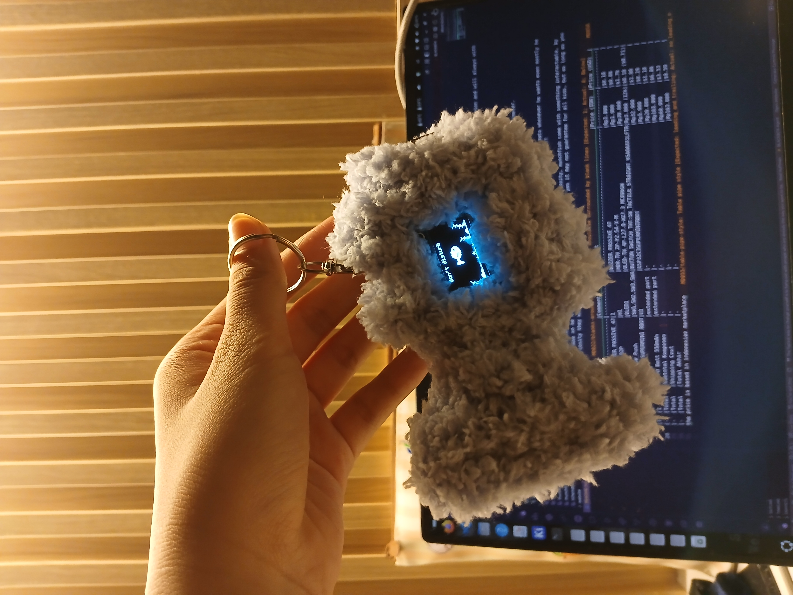
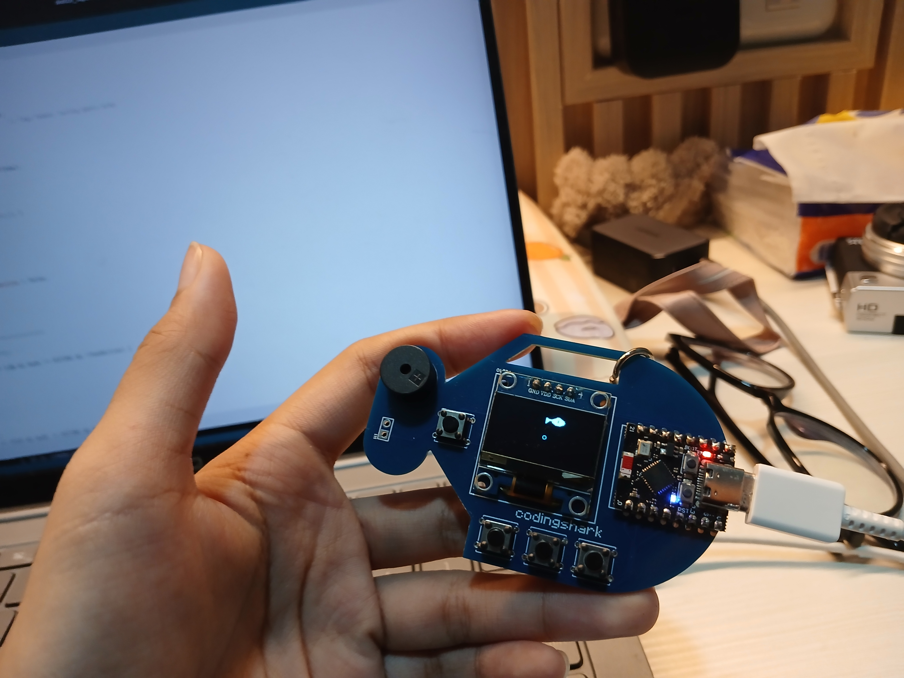

# Munchfish

What if your keychain is an aquarium with cute little fish inside?

Meet munchfish! your very fish keychain that always swim, it works as a little companion and will always with you no matter what, it could hanging on your bag!

Munchfish's size is as big as your card, let's say it is not that big right? the actual size is 8.1x5.2 in centimeter. i still work on case so for temporary case i use thick pipe cleaner.

here is the [demo video](https://drive.google.com/file/d/1yBsQS2uueLiC4brjsU2Olyx7SvKR2_dp/view?usp=sharing)

## features

each button has 2 types of push, long push and short push

-always display text/no-text

-fish status

-to-do-list

-spotify preview when BLE connected

-mini game: flappy fish

-pomodoro streak

-feed the fish

## problem solving

Ever face a really hard to dicipline children? for me it is my little brother, he hates dicipline, he eats whenever he wants even mostly he never wants, he postpones homework, even sleep irregularly it is frustrating because oh god he just 8?!

that is why i come with this solution, no child say no to something sparks their curiosity, munchfish come with something interactable, by including him in building phase so he trying his best to make what matter for him, yes it may not guarantee for all kids, but as long as you know what sparks their curiosity they will do anything to know and know more.

## bill of materials

|No.|Quantity|Component              |Comment        |Footprint                                         |Price (IDR)  |Price (USD)  |
|---|--------|-----------------------|---------------|--------------------------------------------------|-------------|-------------|
|1  |1       |BUZZERBUZZER_PASSIVE_47|1              |BUZZER_PASSIVE_47                                 |Rp3.000      |$0.12        |
|2  |1       |PZ254V-11-02P          |H1             |HDR-TH_2P-P2.54-V-M                               |Rp1.000      |$0.06        |
|3  |1       |MC096GW                |OLED1          |OLED-TH_4P-L27.8-W27.3_MC096GW                    |Rp30.000     |$1.76        |
|4  |4       |Switch_SW_Push         |SW1,SW2,SW3,SW4|BUTTON_SWITCH_THT:SW_TACTILE_STRAIGHT_KSA0AXX1LFTR|Rp3.000      |$0.18        |
|5  |1       |ESP32 C3 SUPERMINI RBOT|U1             |ESP32C3SUPERMINIRBOT                              |Rp32.000     |$1.88        |
|6  |1       |TP4056                 |extended part  |-                                                 |Rp5.000      |$0.29        |
|7  |1       |LI-PO Batt 550mAh      |extended part  |-                                                 |Rp20.000     |$1.18        |
|-  |Total   |Subtotal Komponen      |-              |-                                                 |Rp103.000    |$6.06        |
|-  |Total   |Shipping Cost          |-              |-                                                 |Rp60.000     |$3.53        |
|-  |Total   |Total Akhir            |-              |-                                                 |Rp163.000    |$9.59        |
the price is based in indonesian marketplace
